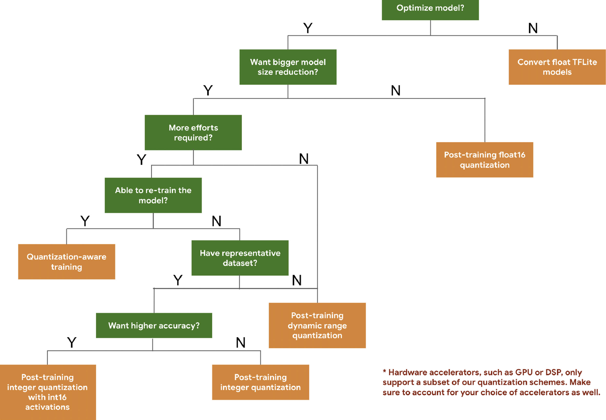
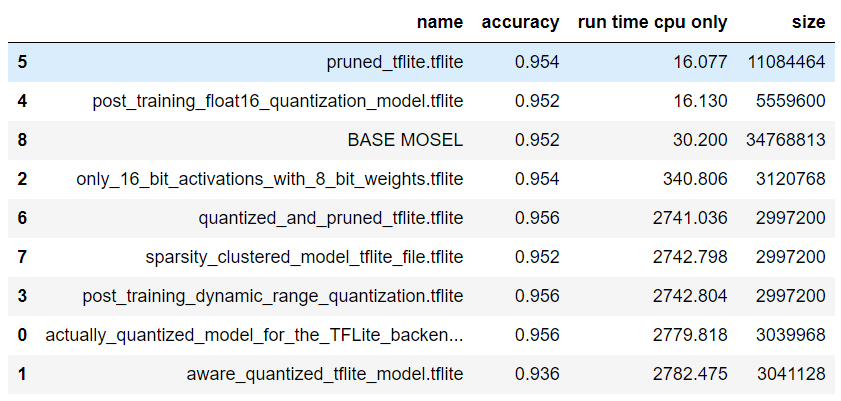

__Алексей Панчук__, [20.10.21 20:30]  
__Задача исследования:__   
Попытаться изучить подход, понять варианты оптимизаций и какие нейросетевые модели можно использовать

__Цель исследования:__
- Выбрать оптимальный подход автоматического конвертирования нейросетевых моделей под конечную платформу.   
  Конечная платформа ARM (распберри) и/или Jetson платы (cuda). 
- Описать подходы взаимодействия, какие языки используются, какие входящие и исходящие данные в момент компиляции.
- Описать методы и подходы разворачивания системы на конечном устройстве, что для этого нужно.
  Как происходит адаптация и интеграция полученных моделей (или объектов) в конечный работающий проект.
  
___

### Были рассмотрены два подхода.  ###
а) __Tensorflow.__   
б) __TVM.__

Оба фреймворка решают одну и ту же задачу - оптимизация и запуск сети на конечном устройстве. 

__Схема работы предложенная Tenserflow:__  
1. Берете свою сеть (а лучше выбираете одну из уже пред обученных сетей из депозитария __Tensorflow__).
2. Оптимизируете сеть с помощью __TensorFlow Lite converter__ придерживаясь следующей схемы.

3. Экспорт модели на устройство и запуск ее там с учетом всех имеющихся аппаратных ускорителей устройства.  

(Если вдруг вам не хватает вышеописанных средств, и вы чувствуете в себе способности написать код более подходящий для вашего случая то велком в увлекательный мир низкоуровневого программирования на __tf__. Инструменты для этого предлагаются.)

_Для запуска на конечных устройсвах Tensorflow предоставляет такие скрвисы как :  __Build TensorFlow Lite for Android, Build TensorFlow Lite for iOS, Build TensorFlow Lite for ARM boards__ и т.д._

Хорошее описание всего процесса запуска модели https://www.tensorflow.org/lite/performance/best_practices .

__Схема работы предложенная TVM:__
1. Берете свою сеть (а лучше выбираете одну из уже пред обученных сетей ) и загружаете в __TVM__.
2. Оптимизируете ее с помощью __AutoTVM__.  __AutoTVM__ под капотом использует все те же подходы что и __TensorFlow Lite converter__ но только не дает вам выбора а пытается сама найти наилучший баланс методов.
3. Компиляция под конкретный девайс в среде __TVM__.
4. Экспорт и запуск модели на конечном устройстве.

Ну и как в случае с __Tenserflow__ - Если вдруг вам не хватает вышеописанных средств, и вы чувствуете в себе способным написать код более подходящий для вашего случая то велком в увлекательный мир низкоуровневого программирования на новых неизвестных языках программирования.  
Инструменты для этого предлагаются...

## Краткие выводы. ##
1. Если изначально весь код пишется на __tensorflow/keras__ то лучший вариант это и далее делать все возможные оптимизации в этой среде то есть с использованием __tensorflow lite__.
2. Если модели оптимизированы при помощи __tflite__ то еще больше оптимизировать их средствами __TVM__ вряд ли получиться.
3. Мое субъективное мнение - __Tensorflow__ в вопросе оптимизации моделей продвинулся дальше чем __TVM__.

По сведениям пользователя __из блога TVM__ модели __TFLite__ работают лучше.

4. Если же код пишется на чем то другом то имеет смысл использовать __TVM__.

### ПОДРОБНОСТИ - ТОГО ЧТО БЫЛО СДЕЛАНО. ###
Изначально была обучена тестовая модель классификации написанная на __Tensorflow/Keras__.  

Модель была сохранена как базовая ( __./base__ ) для дальнейших возможных оптимизаций.  
Средствами __tflite__ (различными методами( файлы в __./make_models__  )) были обучены восемь различных модернизированных вариантов базовой модели ( файлы в __./new_models__   ).
Затем они были протестированы ( файлы в __./test_new_models__   ).  

Две модели работали быстрее базовой.  
Все модели были не больше базовой.  
Точность пяти из них больше базовой.  

(тест заключался в запуске 500 одних и тех же примеров для каждой модели)

Затем (так как была идея запускать через opencv ) попытался конвертировать полученные __.tflite__ файлы в форматы __.onnx__ и затем в __.pb__...
Файлы конвертировались... но __opencv__ их запускать отказывался напрочь...
(убил на это кучу времени. Если у вас вдруг получитья их запустить то поделитесь как вам это удалось.)

Затам решил попробовать оптимизировать полученные __tflite__ модели с использованием __TVM__.

При всей декларируемой совместимости, запустить в __TVM__ среде удалось только четыре модели из восьми.

Автоматически оптимизировать удалось только одну (самую простую).

